# EducAlin

Sistema inteligente de acompanhamento educacional individualizado para identificar e sanar dificuldades de aprendizado.

## Sumário

- [Equipe](#equipe-educalin)
- [Início Rápido](#início-rápido)
  - [Instalação](#instalação)
  - [Configurar Banco de Dados](#configurar-banco-de-dados)
  - [Executar Testes](#executar-testes)
  - [Iniciar API](#iniciar-api)
- [Descrição do Domínio](#descrição-detalhada-do-domínio)
- [Estrutura de Pastas](#estrutura-de-pastas)
- [Banco de Dados e Persistência](#banco-de-dados-e-persistência)
  - [Single Table Inheritance](#single-table-inheritance-sti)
  - [Relacionamentos](#relacionamentos)
  - [Migrations com Yoyo](#migrations-com-yoyo)
  - [Exemplo de Uso](#exemplo-de-uso-completo)
- [Tecnologias e Dependências](#tecnologias-e-dependências)
- [Justificativa da Complexidade](#justificativa-da-complexidade-do-sistema)
- [Diagrama UML](#diagrama-uml-classes-e-relações)
- [Hierarquias Previstas](#hierarquias-previstas)
- [Padrões de Projeto](#padrões-de-projeto-planejados)
- [Princípios SOLID](#princípios-solid-que-serão-aplicados)
- [Testes](#testes)
- [Comandos Úteis](#comandos-úteis)
- [Documentação Adicional](#documentação-adicional)
- [Contribuindo](#contribuindo)
- [Licença](#licença)

---

## Equipe EducAlin

| Nome | GitHub |
| :---- | :---- |
| Elder Rayan Oliveira Silva | [@eldrayan](https://github.com/eldrayan) |
| Samuel Wagner Tiburi Silveira | [@samsilveira](https://github.com/samsilveira) |
| Pedro Yan Alcantara Palacio | [@pedropalacioo](https://github.com/pedropalacioo) |

## Início Rápido

### Instalação

```bash
# Clonar repositório
git clone https://github.com/seu-usuario/educalin.git
cd educalin

# Instalar dependências via Poetry
poetry install

# Ou via pip
pip install -e .
pip install yoyo-migrations
```

### Configurar Banco de Dados

```bash
# Opção 1: Usar yoyo-migrations
cd database
yoyo apply

# Opção 2: Usar Python
python -c "
import sqlite3
from src.educalin.repositories.models import create_all_tables
conn = sqlite3.connect('database/educalin.db')
conn.execute('PRAGMA foreign_keys = ON')
create_all_tables(conn)
conn.close()
"
```

### Executar Testes

```bash
# Rodar todos os testes
poetry run pytest

# Com cobertura
poetry run pytest --cov=src/educalin --cov-report=html
```

### Iniciar API

```bash
poetry run uvicorn src.educalin.api.main:app --reload
```

## Banco de Dados e Persistência

### Tecnologia

O sistema utiliza **SQLite puro** (sqlite3 nativo do Python) sem ORM, proporcionando:
- Controle total sobre queries SQL
- Performance otimizada
- Zero dependências externas pesadas
- Facilidade de deployment

### Arquitetura de Modelos

#### Single Table Inheritance (STI)

Implementamos STI para duas hierarquias principais:

**1. Usuários** (`usuarios` table)
```
Usuario (discriminador: tipo_usuario)
├── Professor (registro_funcional)
├── Coordenador (codigo_coordenacao)
└── Aluno (matricula)
```

**2. Materiais** (`materiais` table)
```
MaterialEstudo (discriminador: tipo_material)
├── MaterialPDF (num_paginas)
├── MaterialVideo (duracao_segundos, codec)
└── MaterialLink (url, tipo_conteudo)
```

**Polimorfismo Automático:**
```python
from educalin.repositories.models import UsuarioModel, MaterialModel

# Buscar retorna automaticamente a subclasse correta
professor = UsuarioModel.buscar_por_id(conn, 1) # Retorna ProfessorModel
print(type(professor).__name__) # ProfessorModel

material = MaterialModel.buscar_por_id(conn, 5) # Retorna MaterialPDFModel
print(material.num_paginas) # Acesso direto às propriedades específicas
```

#### Relacionamentos

**Foreign Keys (1:N)**
- `materiais.autor_id` → `usuarios.id` (professor)
- `turmas.professor_id` → `usuarios.id`
- `avaliacoes.turma_id` → `turmas.id`
- `notas.aluno_id` → `usuarios.id`
- `notas.avaliacao_id` → `avaliacoes.id`
- `metas.aluno_id` → `usuarios.id`
- `planos_acao.aluno_id` → `usuarios.id`

**Many-to-Many**
- `turmas` ↔ `usuarios` (alunos) via `turma_alunos`
- `planos_acao` ↔ `materiais` via `plano_materiais` (composição)

### Migrations com Yoyo

#### Estrutura de Migrations

```
database/migrations/
├── 001_create_usuarios_table.py # Usuários (STI)
├── 002_create_turmas_tables.py # Turmas + turma_alunos (N:N)
├── 003_create_materiais_table.py # Materiais (STI)
├── 004_create_avaliacoes_table.py # Avaliações
├── 005_create_notas_table.py # Notas (associação)
├── 006_create_metas_table.py # Metas
└── 007_create_planos_acao_tables.py # Planos + plano_materiais (N:N)
```

#### Comandos Úteis

```bash
cd database

# Aplicar todas as migrations
yoyo apply

# Ver status
yoyo list

# Reverter última migration
yoyo rollback

# Aplicar migration específica
yoyo apply --batch
```

### Modelos Disponíveis

```python
from educalin.repositories.models import (
 # Usuários (STI - Single Table Inheritance)
 UsuarioModel, ProfessorModel, CoordenadorModel, AlunoModel,
 
 # Turmas
 TurmaModel,
 
 # Materiais (STI com Polimorfismo)
 MaterialModel, MaterialPDFModel, MaterialVideoModel, MaterialLinkModel,
 
 # Avaliações e Notas
 AvaliacaoModel, NotaModel,
 
 # Metas e Planos
 MetaModel, PlanoAcaoModel,
 
 # Schemas (DDL)
 create_all_tables
)
```

### Exemplo de Uso Completo

```python
import sqlite3
from datetime import date, datetime, timedelta
from educalin.repositories.models import *

# Setup
conn = sqlite3.connect('database/educalin.db')
conn.row_factory = sqlite3.Row
conn.execute("PRAGMA foreign_keys = ON")

# Criar usuários (STI)
prof_id = ProfessorModel.criar(
 conn, "Dr. João Silva", "joao@edu.com", "senha123", "PROF001"
)
aluno_id = AlunoModel.criar(
 conn, "Maria Santos", "maria@edu.com", "senha456", "2024001"
)

# Criar turma e adicionar aluno (N:N)
turma_id = TurmaModel.criar(conn, "POO2024", "POO", "2024.1", prof_id)
turma = TurmaModel.buscar_por_id(conn, turma_id)
turma.adicionar_aluno(conn, aluno_id)

# Criar material (STI com polimorfismo)
pdf_id = MaterialPDFModel.criar(
 conn, "Introdução à POO", "Material teórico", prof_id, num_paginas=50
)

# Criar avaliação e nota (ForeignKeys)
aval_id = AvaliacaoModel.criar(
 conn, "Prova 1", date.today(), valor_maximo=10.0, peso=0.3, turma_id=turma_id
)
nota_id = NotaModel.criar(conn, aluno_id, aval_id, valor=8.5)

# Criar meta
meta_id = MetaModel.criar(
 conn, aluno_id, "Média 9.0", 9.0, datetime.now() + timedelta(days=90), 7.5
)

# Criar plano de ação (composição com materiais)
plano_id = PlanoAcaoModel.criar(conn, aluno_id, "Revisar POO", prazo_dias=30)
plano = PlanoAcaoModel.buscar_por_id(conn, plano_id)
plano.adicionar_material(conn, pdf_id)
plano.atualizar_status(conn, 'enviado')

conn.close()
```

** Para mais exemplos, veja:** [`src/educalin/repositories/EXAMPLES.md`](src/educalin/repositories/EXAMPLES.md)

** Documentação completa do banco:** [`database/README.md`](database/README.md)

## �️ Tecnologias e Dependências

### Core
- **Python 3.12+** - Linguagem base
- **SQLite 3** - Banco de dados (sqlite3 nativo)
- **bcrypt** - Hashing de senhas
- **yoyo-migrations** - Gerenciamento de migrations

### Web Framework
- **FastAPI** - Framework web moderno e rápido
- **Uvicorn** - Servidor ASGI
- **Jinja2** - Template engine

### Desenvolvimento e Testes
- **pytest** - Framework de testes
- **pytest-cov** - Cobertura de testes
- **Poetry** - Gerenciamento de dependências

### Relatórios e Exportação
- **fpdf2** - Geração de PDFs
- **pandas** - Manipulação de dados
- **openpyxl** - Exportação para Excel

### Instalação de Dependências

```bash
# Via Poetry (recomendado)
poetry install

# Via pip
pip install -e .
pip install yoyo-migrations pytest pytest-cov

# Instalar dependências de dev
pip install fpdf2 pandas openpyxl
```

## Descrição detalhada do domínio

O cenário educacional de base no Brasil enfrenta um desafio significativo: a ausência de um acompanhamento individualizado do aluno. Em um modelo de sala de aula tradicional, os professores encontram dificuldade para identificar e sanar as dificuldades particulares de cada estudante, especialmente a falta de base em conteúdos fundamentais. Essa lacuna resulta em uma queda no desempenho, com alunos progredindo entre os anos escolares sem o domínio de conhecimentos essenciais e gera o que é descrito como uma "relação alienada" entre professor e aluno.

O sistema EducAlin surge como uma ferramenta tecnológica auxiliar para endereçar este problema através de:

1. Análise Individualizada de Dados: Sistema inteligente que processa notas, frequência e desempenho em tópicos específicos para identificar padrões e dificuldades de cada aluno.
2. Geração Dinâmica de Conteúdo: Recomendação automática de materiais de estudo personalizados baseada nas dificuldades identificadas, utilizando diferentes estratégias de análise.
3. Múltiplos atores e Regras Complexas:
 - Professores: Criam turmas, registram notas associadas a tópicos, geram relatórios, criam Planos de Ação personalizados
 - Alunos: Visualizam desempenho, acessam materiais recomendados, interagem em fóruns, acompanham metas
 - Coordenadores: Geram relatórios consolidados e comparativos entre turmas

A complexidade do sistema justifica POO através de:

- Hierarquias de abstração (usuários, materiais, relatórios, estratégias de análise)
- Polimorfismo estratégico (diferentes tipos de análise, materiais e relatórios processados uniformemente)
- Regras de negócio variáveis (critérios de identificação de dificuldades, permissões por perfil, validações contextuais)
- Composição dinâmica (Planos de Ação agregam materiais, Turmas agregam alunos)

## Estrutura de pastas

```text
educalin/
│
├── src/
│ └── educalin/
│ ├── domain/ # Entidades do domínio
│ │ ├── __init__.py
│ │ ├── usuario.py # Hierarquia Usuario (STI)
│ │ ├── turma.py # Turma + Observer
│ │ ├── material.py # Hierarquia MaterialEstudo (STI)
│ │ ├── avaliacao.py # Avaliação
│ │ ├── nota.py # Nota (classe de associação)
│ │ ├── plano_acao.py # PlanoAcao + Observer
│ │ └── meta.py # Meta + Observer
│ │
│ ├── services/ # Lógica de negócio
│ │ ├── __init__.py
│ │ ├── analisador.py # AnalisadorDesempenho
│ │ ├── estrategias/ # Strategy Pattern
│ │ │ ├── analisefrequencia.py
│ │ │ ├── analisenotasbaixas.py
│ │ │ └── analiseregressao.py
│ │ ├── relatorio.py # Hierarquia GeradorRelatorio
│ │ └── notificador.py # Observers (Email, Push)
│ │
│ ├── factories/ # Factory Method
│ │ ├── __init__.py
│ │ └── material_factory.py
│ │
│ ├── repositories/ # Camada de persistência
│ │ ├── __init__.py
│ │ ├── base.py # Conexão
│ │ ├── base_model.py # Validações comuns
│ │ ├── schemas.py # DDL (CREATE TABLE)
│ │ ├── models.py # Agregador de exports
│ │ ├── usuario_models.py # UsuarioModel (STI)
│ │ ├── turma_models.py # TurmaModel
│ │ ├── material_models.py # MaterialModel (STI)
│ │ ├── avaliacao_models.py
│ │ ├── nota_models.py
│ │ ├── meta_models.py
│ │ ├── plano_acao_models.py
│ │ ├── README.md # Docs de repositórios
│ │ └── EXAMPLES.md # Exemplos de uso
│ │
│ ├── api/ # API REST (FastAPI)
│ │ ├── __init__.py
│ │ ├── main.py
│ │ ├── dependencies.py
│ │ └── routes/
│ │ ├── auth.py
│ │ ├── turmas.py
│ │ └── materiais.py
│ │
│ └── utils/ # Utilitários
│ ├── __init__.py
│ └── mixins.py # AutenticavelMixin, NotificavelMixin
│
├── tests/ # Testes unitários e integração
│ ├── domain/
│ │ ├── test_usuario.py
│ │ ├── test_turma.py
│ │ ├── test_material.py
│ │ ├── test_avaliacao.py
│ │ ├── test_nota.py
│ │ ├── test_meta.py
│ │ └── test_plano_acao.py
│ ├── services/
│ │ ├── test_analisadordesempenho.py
│ │ ├── test_estrategias.py
│ │ └── test_notificador.py
│ ├── factories/
│ │ └── test_material_factory.py
│ └── integration/
│
├── templates/ # Templates HTML
│ ├── base.html
│ ├── login.html
│ └── dashboard/
│
├── static/ # Assets estáticos
│ ├── css/
│ └── js/
│
├── database/ # Banco de dados e migrations
│ ├── educalin.db # SQLite database
│ ├── yoyo.ini # Configuração yoyo
│ ├── migrations/ # Migrations ordenadas
│ │ ├── 001_create_usuarios_table.py
│ │ ├── 002_create_turmas_tables.py
│ │ ├── 003_create_materiais_table.py
│ │ ├── 004_create_avaliacoes_table.py
│ │ ├── 005_create_notas_table.py
│ │ ├── 006_create_metas_table.py
│ │ └── 007_create_planos_acao_tables.py
│ └── README.md # Docs do banco de dados
│
├── docs/ # Documentação
│ ├── poo_especificacao_projeto.md
│ ├── Requisitos_EducAlin.md
│ └── proposta.md
│
├── htmlcov/ # Relatórios de cobertura
│
├── .gitignore
├── LICENSE
├── pyproject.toml # Dependências e configuração
├── pytest.ini # Configuração pytest
└── README.md # Este arquivo
```

## Justificativa da complexidade do sistema

1. **Análise de Dados Individualizada:**

 - Identificação automática de dificuldade por múltiplos critérios (nota < 60%, frequência baixa, regressão temporal)
 - Aplicação de diferentes estratégias de análise (Strategy Pattern) configuráveis por professor
 - Cálculos de indicadores de desempenho agregados (por tópico, disciplina, período)
 - Geração de sugestões personalizadas baseadas em regra de negócio

2. **Geração Dinâmica de Conteúdo:**

 - Criação polimórfica de diferentes tipos de materiais (PDF, Vídeo, Link) via Factory Method
 - Validação específica por tipo de material
 - Composição dinâmica de Planos de Ação com materiais heterogêneos
 - Sistema de recomendação que cruza dificuldade dos alunos com materiais disponíveis

3. **Múltiplos Atores e Regras:**

 - 3 perfis de usuário com permissões e funcionalidades distintas
 - Hierarquia múltipa (AutenticavelMixin + NotificavelMixin + Usuario)
 - Fluxos condicionais baseados em perfil, status, dados históricos
 - Eventos e notificações assíncronas (Observer Pattern) para múltiplos interessados

4. **Arquitetura em Camadas:**

 - Domínio: Entidades (Usuario, Turma, PlanoAcao, MaterialEstudo)
 - Aplicação: Serviços (AnalisadorDesempenho, GeradorRelatorio)
 - Infraestrutura: Repositórios, Notificadores, Factories

## Diagrama UML (classes e relações)

```mermaid
classDiagram
 %% Hierarquia de Usuários
 class Usuario {
 <<abstract>>
 -str _nome
 -str _email
 -str __senha
 +autenticar()*
 +validar_credenciais()
 }
 
 class AutenticavelMixin {
 +validar_credenciais()
 +resetar_senha()
 }
 
 class NotificavelMixin {
 +receber_notificacao(mensagem)
 +configurar_preferencias_notificacao()
 }
 
 class Professor {
 -str _registro_funcional
 -List~Turma~ _turmas
 +criar_plano_acao(aluno)
 +registrar_nota(aluno, avaliacao, nota)
 +gerar_relatorio(tipo)
 }
 
 class Aluno {
 -str _matricula
 -Dict~str,float~ _desempenho
 +visualizar_desempenho()
 +acessar_material(material_id)
 }
 
 class Coordenador {
 -str _codigo_coordenacao
 +gerar_relatorio_consolidado()
 +comparar_turmas()
 }
 
 Usuario <|-- Professor
 Usuario <|-- Aluno
 Usuario <|-- Coordenador
 AutenticavelMixin <|-- Professor
 AutenticavelMixin <|-- Aluno
 AutenticavelMixin <|-- Coordenador
 NotificavelMixin <|-- Aluno
 NotificavelMixin <|-- Professor

 %% Hierarquia de Materiais
 class MaterialEstudo {
 <<abstract>>
 -str _titulo
 -str _descricao
 -datetime _data_upload
 -Professor _autor
 +validar_formato()*
 +obter_tamanho()
 }
 
 class MaterialPDF {
 -int _num_paginas
 +validar_formato()
 +extrair_texto()
 }
 
 class MaterialVideo {
 -int _duracao_segundos
 -str _codec
 +validar_formato()
 +gerar_thumbnail()
 }
 
 class MaterialLink {
 -str _url
 -str _tipo_conteudo
 +validar_formato()
 +verificar_disponibilidade()
 }
 
 MaterialEstudo <|-- MaterialPDF
 MaterialEstudo <|-- MaterialVideo
 MaterialEstudo <|-- MaterialLink

 %% Hierarquia: Estratégias de Análise
 class EstrategiaAnalise {
 <<abstract>>
 +analisar(aluno, historico)*
 +identificar_dificuldades()*
 }
 
 class AnaliseNotasBaixas {
 -float _limite_nota
 +analisar(aluno, historico)
 +identificar_dificuldades()
 }
 
 class AnaliseFrequencia {
 -int _min_avaliacoes
 +analisar(aluno, historico)
 +identificar_dificuldades()
 }
 
 class AnaliseRegressao {
 +analisar(aluno, historico)
 +identificar_dificuldades()
 +calcular_tendencia()
 }
 
 EstrategiaAnalise <|-- AnaliseNotasBaixas
 EstrategiaAnalise <|-- AnaliseFrequencia
 EstrategiaAnalise <|-- AnaliseRegressao

 %% Hierarquia: Relatórios
 class GeradorRelatorio {
 <<abstract>>
 +gerar()*
 #coletar_dados()*
 #processar_dados()
 #formatar_saida()*
 #exportar(formato)
 }
 
 class RelatorioTurma {
 -Turma _turma
 +gerar()
 #coletar_dados()
 #formatar_saida()
 }
 
 class RelatorioIndividual {
 -Aluno _aluno
 +gerar()
 #coletar_dados()
 #formatar_saida()
 }
 
 class RelatorioComparativo {
 -List~Turma~ _turmas
 +gerar()
 #coletar_dados()
 #formatar_saida()
 }
 
 GeradorRelatorio <|-- RelatorioTurma
 GeradorRelatorio <|-- RelatorioIndividual
 GeradorRelatorio <|-- RelatorioComparativo

 %% Classes de Domínio
 class Turma {
 -str _codigo
 -str _nome
 -Professor _professor
 -List~Aluno~ _alunos
 +adicionar_aluno(aluno)
 +remover_aluno(aluno)
 +obter_desempenho_geral()
 }
 
 class PlanoAcao {
 -str _id
 -Aluno _aluno_alvo
 -datetime _data_criacao
 -datetime _data_limite
 -List~MaterialEstudo~ _materiais
 -str _observacoes
 -str _status
 +adicionar_material(material)
 +marcar_concluido()
 }
 
 class Avaliacao {
 -str _titulo
 -str _tipo
 -datetime _data
 -float _valor_maximo
 -str _topico
 +validar_nota(nota)
 }
 
 class Nota {
 -Aluno _aluno
 -Avaliacao _avaliacao
 -float _valor
 -datetime _data_registro
 +calcular_percentual()
 }
 
 class Meta {
 -str _id
 -Aluno _aluno
 -str _descricao
 -float _valor_alvo
 -datetime _prazo
 -float _progresso_atual
 +atualizar_progresso()
 +verificar_conclusao()
 }

 %% Factory Pattern
 class MaterialEstudoFactory {
 <<abstract>>
 +criar_material(dados)*
 }
 
 class MaterialPDFFactory {
 +criar_material(dados)
 }
 
 class MaterialVideoFactory {
 +criar_material(dados)
 }
 
 class MaterialLinkFactory {
 +criar_material(dados)
 }
 
 MaterialEstudoFactory <|-- MaterialPDFFactory
 MaterialEstudoFactory <|-- MaterialVideoFactory
 MaterialEstudoFactory <|-- MaterialLinkFactory
 MaterialEstudoFactory ..> MaterialEstudo : cria

 %% Observer Pattern
 class Subject {
 <<interface>>
 +adicionar_observer(observer)
 +remover_observer(observer)
 +notificar_observers()
 }
 
 class Observer {
 <<interface>>
 +atualizar(evento)
 }
 
 class NotificadorEmail {
 +atualizar(evento)
 -enviar_email(destinatario, mensagem)
 }
 
 class NotificadorPush {
 +atualizar(evento)
 -enviar_push(usuario, mensagem)
 }
 
 Subject <|.. Turma
 Subject <|.. PlanoAcao
 Observer <|.. NotificadorEmail
 Observer <|.. NotificadorPush
 Subject o-- Observer

 %% Strategy Pattern
 class AnalisadorDesempenho {
 -EstrategiaAnalise _estrategia
 +definir_estrategia(estrategia)
 +executar_analise(aluno)
 +gerar_sugestoes()
 }
 
 AnalisadorDesempenho o-- EstrategiaAnalise

 %% Relacionamentos principais
 Professor "1" -- "*" Turma : gerencia
 Turma o-- "*" Aluno : contém
 Professor "1" -- "*" PlanoAcao : cria
 PlanoAcao "*" -- "1" Aluno : destinado a
 PlanoAcao *-- "*" MaterialEstudo : contém
 Professor "1" -- "*" MaterialEstudo : publica
 Avaliacao "1" -- "*" Nota : gera
 Aluno "1" -- "*" Nota : possui
 Professor "1" -- "*" Meta : define
 Meta "*" -- "1" Aluno : atribuída a
```



## Hierarquias previstas

### 1. Hierarquia de Abstração Conceitual: Usuários

 Classe abstrata: `Usuario`
 Subclasses: `Professor`, `Aluno` e `Coordenador`

 Representa o conceito abstrato de "usuário do sistema" com comportamentos comuns (autenticação, perfil) e especializações (professor cria planos, aluno visualiza desempenho, coordenador gera consolidados)
 Método `autenticar()` implementado diferentemente por perfil (professor redireciona para painel de turmas, aluno para dashboard de desempenho).

### 2. Hierarquia de Variação de Comportamento: Materiais de Estudo

 Classe abstrata: `MaterialEstudo`
 Subclasses: `MaterialPDF`, `MaterialVideo` e `MaterialLink`

 Cada tipo de material tem regras de validação e processamento específicas (PDF valida número de páginas, Vídeo gera thumbnail, Link verifica disponibilidade).
 Método polimórfico `validar_formato()` chamado durante upload independentemente do tipo, com comportamento específico por subclasse.

### 3. Hierarquia de Estratégia de Análise

 Classe abstrata: `EstrategiaAnalise`
 Subclasses: `AnaliseNotasBaixas`, `AnaliseFrequencia`, `AnaliseRegressao`

 Diferentes critérios para identificar dificuldades permitem personalização de análise pelo professor. Strategy Pattern permite trocar algoritmo em tempo de execução.
 `AnalisadorDesempenho` executa estratégia configurada para gerar sugestões de materiais no Plano de Ação.

### 4. Hierarquia de Geração de Relatórios

 Classe abstrata: `GeradorRelatorio`
 Subclasses: `RelatorioTurma`, `RelatorioIndividual`, `RelatorioComparativo`

 Todos os relatórios seguem processo comum (coletar -> processar -> formatar -> exportar), mas com variações nas etapas.
 Professor solicita relatório de turma ou individual através da mesma interface mas a coleta e formatação mudam conforme o tipo.

### 5. Herança Múltipla: Mixin

 Mixins: `AutenticavelMixin`, `NotificavelMixin`
 Classes que utilizam: `Professor`, `Aluno`, `Coordenador`

 Funcionalidades ortogonais (autenticação e notificação) são compartilhadas entre perfis sem duplicação de código.
 Mixins não dependem de `Usuario`, apenas adicionam comportamentos reutilizáveis.

## Padrões de projeto planejados

### Factory Method

Criar diferentes tipos de materiais de estudo sem acoplar código às classes concretas.
Hierarquia de factories que instanciam o tipo correto baseado em metadados do arquivo.

Classes participantes:

- `MaterialEstudoFactory` como abstract factory
- `MaterialPDFFactory`, `MaterialVideoFactory`, `MaterialLinkFactory` como concrete factories
- Hierarquia `MaterialEstudo`

Quando o professor faz upload de arquivo, o sistema detecta a extensão e chama a factory correspondente para criar instância válida.

### Strategy

Variar algoritmo de análise de desempenho sem modificar `AnalisadorDesempenho`.
Encapsular cada critério de análise (notas baixas, frequência, regressão) em classes de estratégia intercambiáveis.

Classes participantes:

- `EstrategiaAnalise` como strategy interface
- `AnaliseNotasBaixas`, `AnaliseFrequencia`, `AnaliseRegressao` como concrete strategies
- `AnalisadorDesempenho` como context

Professor (ou escola) configura critério preferido para identificar dificuldades. Sistema aplica estratégia correspondente ao gerar sugestões de Plano de Ação.

### Observer

Notificar múltiplos componentes quando eventos ocorrerem (nota registrada, material publicado, meta atingida) sem acoplamento forte.
Subjects (Turma, PlanoAcao) mantêm lista de observers (NotificadorEmail, NotificadorPush, AtualizadorRelatorio) e os notificam em eventos.

Classes participantes:

- `Subject` como observable interface
- `Turma`, `PlanoAcao` como concrete subjects
- `NotificadorEmail`, `NotificadorPush`, `AtualizadorRelatorio` como concrete observers

Professor registra nova nota -> Turma notifica observers -> Email enviado ao aluno + Dashboard atualizado + Relatório recalculado.

## Princípios SOLID que serão aplicados

### Single Responsability Principle (SRP)

Aplicação:

- `Aluno`: Apenas dados e comportamentos do aluno (perfil, matrícula, desempenho)
- `AnalisadorDesempenho`: Apenas lógica de análise de dados
- `NotificadorEmail`: Apenas envio de notificação por email
- `PlanoAcao`: Apenas orquestração de materiais para um aluno

Lógica de análise de desempenho não fica em `Aluno`, mas em serviço dedicado `AnalisadorDesempenho`.

### Open/Closed Principle (OCP)

Aplicação:

- Hierarquia `MaterialEstudo`: Sistema aberto para novos tipos de material (MaterialAudio, MaterialQuiz) sem modificar código existente.
- Strategy de Análise: Novas estratégias adicionadas sem alterar `AnalisadorDesempenho`.
- Observer: Novos observers (NotificadorSMS) adicionados sem alterar subjects.

Adicionar MaterialAudio apenas requer criar subclasse de `MaterialEstudo` e factory correspondente. Nenhuma linha de código existente é modificada.

### Liskov Substitution Principle (LSP)

Aplicação:

- Qualquer `MaterialEstudo` (PDF, Vídeo, Link) pode substituir a abstração sem quebrar o sistema.
- `PlanoAcao.adicionar_material(material: MaterialEstudo)` funciona com qualquer subtipo.
- Subclasses mantêm contrato da superclasse (todas implementam `validar_formato()`)

Método que recebe `List[MaterialEstudo]` processa corretamente PDFs, Vídeos e Links.

### Interface Segregation Principle (ISP)

Aplicação:

- `Autenticavel`: `login()`, `logou()`, `validar_credenciais()`
- `Notificavel`: `receber_notificacao()`, `configurar_preferencias()`
- `Relatoravel`: `gerar_relatorio()`, `exportar_dados()`

Classes implementam apenas interfaces necessárias:

- `Aluno`: `Autenticavel + Notificavel`
- `Professor`: `Autenticavel + Notificavel + Relatoravel`
- `Coordenador`: `Autenticavel + Relatoravel`

`Aluno` não é forçado a implementar `gerar_relatorio()` que não usa.

### Dependency Inversion Principle (DIP)

Aplicação:

- `AnalisadorDesempenho` depende de `EstrategiaAnalise` (abstração), não de implementações concretas
- `PlanoAcao` depende de `MaterialEstudo` (abstração), não de MaterialPDF, MaterialVideo, etc.
- Repositórios dependem de interfaces, não de implementações concretas de banco

Professor pode trocar estratégia de análise em runtime sem modificar `AnalisadorDesempenho`.

## Testes

### Estrutura de Testes

```text
tests/
├── domain/ # Testes unitários de entidades
│ ├── test_usuario.py
│ ├── test_turma.py
│ ├── test_material.py
│ ├── test_avaliacao.py
│ ├── test_nota.py
│ ├── test_meta.py
│ └── test_plano_acao.py
├── services/ # Testes de lógica de negócio
│ ├── test_analisadordesempenho.py
│ ├── test_estrategias.py
│ └── test_notificador.py
├── factories/ # Testes de Factory Method
│ └── test_material_factory.py
└── integration/ # Testes de integração
```

### Executar Testes

```bash
# Rodar todos os testes
poetry run pytest

# Testes com verbose
poetry run pytest -v

# Testes específicos
poetry run pytest tests/domain/test_usuario.py

# Com cobertura
poetry run pytest --cov=src/educalin --cov-report=html

# Visualizar cobertura
open htmlcov/index.html # Linux/Mac
start htmlcov/index.html # Windows
```

### Cobertura Atual

- **Domain**: ~95% cobertura
- **Services**: ~90% cobertura
- **Factories**: ~100% cobertura
- **Repositories**: ~85% cobertura

**Relatório de cobertura:** [`htmlcov/index.html`](htmlcov/index.html)

## Comandos Úteis

### Banco de Dados

```bash
# Criar todas as tabelas
python -c "from src.educalin.repositories.models import *; import sqlite3; conn = sqlite3.connect('database/educalin.db'); conn.execute('PRAGMA foreign_keys = ON'); create_all_tables(conn)"

# Aplicar migrations
cd database && yoyo apply

# Rollback migrations
cd database && yoyo rollback

# Ver status das migrations
cd database && yoyo list
```

### Desenvolvimento

```bash
# Instalar em modo de desenvolvimento
poetry install

# Adicionar nova dependência
poetry add nome-pacote

# Atualizar dependências
poetry update

# Formatar código (se configurado)
poetry run black src/

# Linting (se configurado)
poetry run flake8 src/
```

### API

```bash
# Iniciar servidor de desenvolvimento
poetry run uvicorn src.educalin.api.main:app --reload

# Iniciar em porta específica
poetry run uvicorn src.educalin.api.main:app --reload --port 8080

# Acessar documentação interativa
# http://localhost:8000/docs (Swagger UI)
# http://localhost:8000/redoc (ReDoc)
```

## Documentação Adicional

- **[Requisitos EducAlin](docs/Requisitos_EducAlin.md)** - Requisitos funcionais e não-funcionais
- **[Especificação POO](docs/poo_especificacao_projeto.md)** - Detalhes técnicos de POO
- **[Proposta do Projeto](docs/proposta.md)** - Proposta inicial
- **[README do Banco de Dados](database/README.md)** - Documentação completa de migrations e modelos
- **[Exemplos de Uso](src/educalin/repositories/EXAMPLES.md)** - Exemplos práticos de código
- **[README de Repositórios](src/educalin/repositories/README.md)** - Documentação da camada de persistência

## Contribuindo

1. Fork o projeto
2. Crie uma branch para sua feature (`git checkout -b feature/AmazingFeature`)
3. Commit suas mudanças (`git commit -m 'Add some AmazingFeature'`)
4. Push para a branch (`git push origin feature/AmazingFeature`)
5. Abra um Pull Request

### Convenções

- **Commits**: Use [Conventional Commits](https://www.conventionalcommits.org/)
- **Code Style**: Siga PEP 8
- **Testes**: Mantenha cobertura acima de 85%
- **Docstrings**: Use formato Google Style

## Licença

Este projeto está sob a licença MIT. Veja o arquivo [LICENSE](LICENSE) para mais detalhes.

## Autores

Desenvolvido como projeto acadêmico de Programação Orientada a Objetos.

- **Elder Rayan Oliveira Silva** - [@eldrayan](https://github.com/eldrayan)
- **Samuel Wagner Tiburi Silveira** - [@samsilveira](https://github.com/samsilveira)
- **Pedro Yan Alcantara Palacio** - [@pedropalacioo](https://github.com/pedropalacioo)

---

**Se este projeto foi útil para você, considere dar uma estrela!**

**Contato**: Para dúvidas ou sugestões, abra uma [issue](https://github.com/seu-usuario/educalin/issues).
